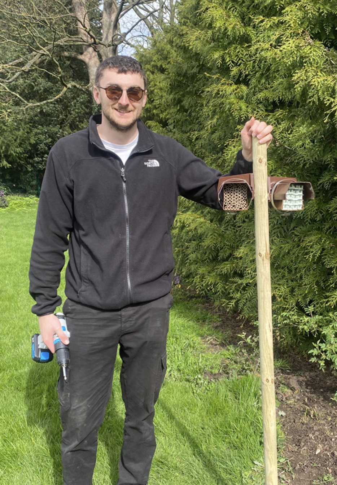
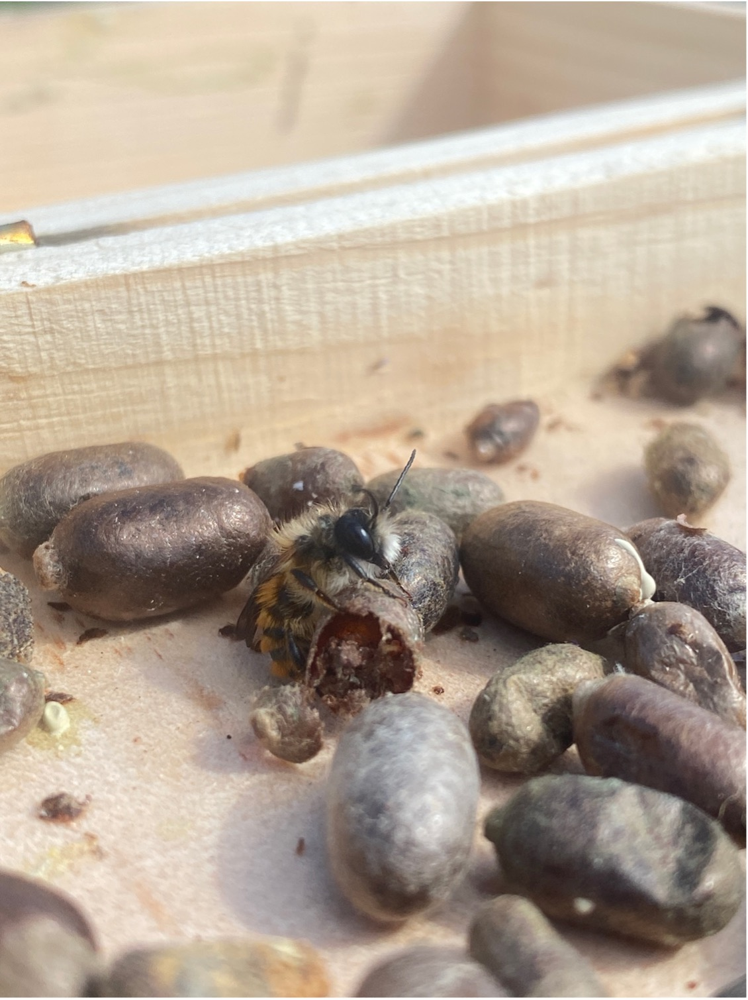
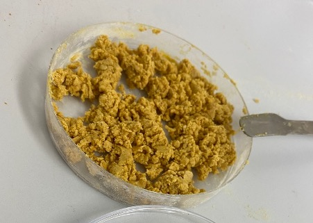

Spring is well underway and despite the somewhat turbulent weather we are experiencing at the moment, solitary bee season waits for no one…

Good progress has been made on the current project with the installation of the mason bee boxes, aiming to encourage nesting for subsequent larval retrieval and use in diet and temperature manipulations. The use of guttering fixtures have been a great success in providing shelter and attaching nest boxes in place. Two locations have been chosen in the Hull area, a community orchard, and a botanical garden, with multiple nesting locations at each. 

Cocoons have been released at all nesting positions in wooden boxes fixed on top of stakes. Male emergence is in full swing with fuzzy orange bees breaking from their cocoons and warming up, before flying off out to feed and patrol for females. It is now a waiting game for activity from the larger female cocoons, where a male scramble to mate will ensue upon their awakening. Daily checking is taking place, eagerly watching for signs of the first females to start nesting. Cells with pollen provisions will then be packed into the nesting tubes by the females, each with a single egg laid and the use of mud to cap off the individual chambers, repeated to fill the tubes. 

In the lab, preparations have been taking place ready for when nesting begins. Artificial pollen diet formulations have been trialled to refine final recipes that will be fed to the larvae. A range of macronutrient ratios will be given to the developing larvae to include high and low Protein, Carbohydrate and Lipid content, under multiple temperatures, with the aim to assess consumption, growth, survival, and fertility.

Finally, on a personal note, I feel that I have settled well into my first 8 months of my PhD at Hull and am really enjoying the project so far. James and I have already had lots of interesting discussions and ideas for future work and now that my first experiment is finally starting to kick off, it feels good to see progress. I will no doubt be rushed off my feet in the coming weeks, inundated with bee larvae…fingers crossed!

Jamie

