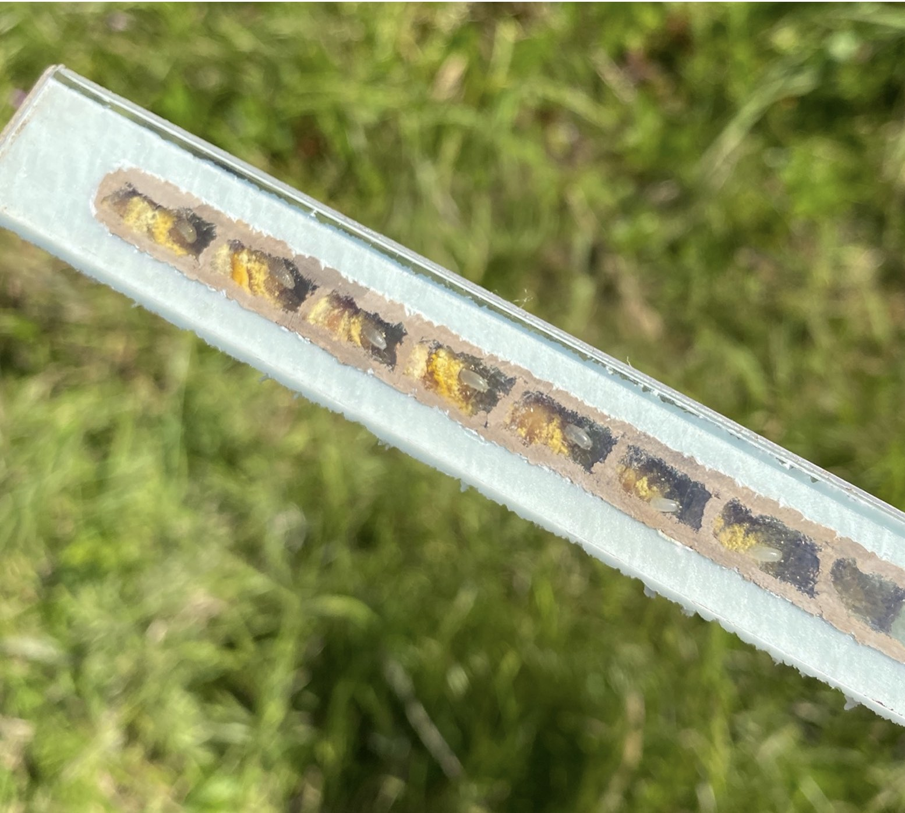

And just like that, almost two months have shot by since my previous bee update and what a crazy time it has been. We have been inundated with mason bee activity at all of our nesting sites, with over 250 completed tubes to date. I am currently deep into my first lab experiment which has been both extremely labour intensive and exciting at the same time. Despite a few bumps in the road, I am hopeful we will be able to draw out some meaningful observations and I have already started to think about follow up questions which is great.

Being relatively new to _Osmia_ research, it has been fun to finally experience first-hand their intricate biology throughout the different life stages, and I am looking forward to my continued investigation into their resilience to environmental change. 

I had some brief downtime from my experiment last week as it was my DTP conference in York, which was fun and a great chance to catch up with my colleagues working at other institutions. Also, as I write this, I am on a train to Edinburgh for the Society of Experimental Biology centenary conference, packed with lots of exciting research. 

Until next time!

Jamie

Jamie

